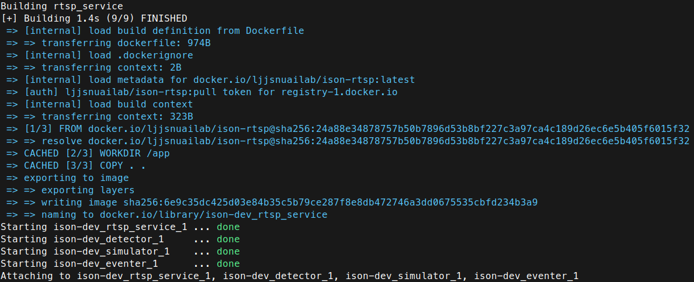
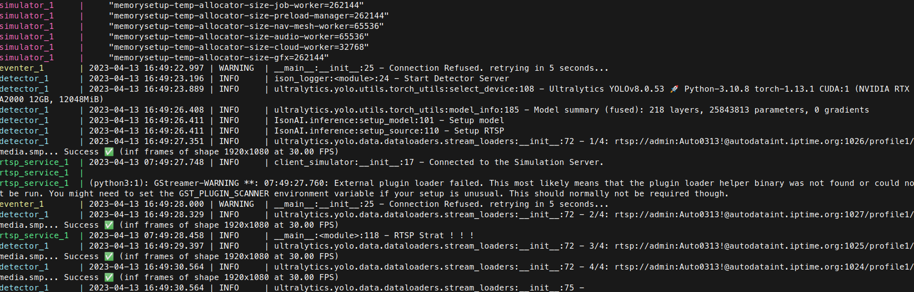
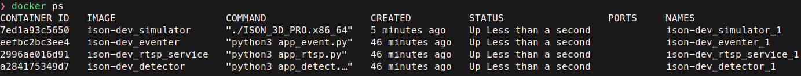

<h1 align="center">ISON: Detector and Tracking<br>Event Generator & Simulator Visualization</h1>

<p align="center">
  
</p>

<p align="center">
    이종진</a><sup>1*</sup> &emsp;&emsp;
    고대관</a><sup>2*</sup> &emsp;&emsp;
    김성근</a><sup>3*</sup> &emsp;&emsp;
</p>

<p align="center">
    ISON Project by SNUAILAB-dev
</p>
<p align="center">
    <a href="https://github.com/snuailab-biz/ison-dev">Demo</a>
</p>

---

## Code and Data
- [x] 📣 Detector Server **highly!**
- [x] 📣 Event Generator
- [x] 📣 RTSP Server
- [x] 📣 C# 3D Simulator. **highly!**
- [x] Docker image for ISON Project. 
- [x] Automatically run at desktop startup
- [ ] Release of the ISON Site


## Installation
 ISON 터널 관제 시스템에 필요한 실행 프로세스는 다음과 같이 진행한다. 납품할 Desktop에 다음을 참고하여 환경 설정을 진행해야한다.  
<p align="justify">
    <a href="https://github.com/snuailab-biz/ison-dev/blob/main/docs/environment.md">Installation Guide</a>
</p>

## Github Download
Ison Project의 관련 코드와 설정을 위한 파일을 다운로드한다.  
<a href="https://github.com/snuailab-biz/ison-dev">Github : Ison project</a>
<>Code를 통해 다운로드를 하거나 git clone을 통해 실행할 desktop에 설치한다.
### Directories
```Plane Text
├── assets
├── docker-compose.yml
├── docker.service
├── docs
├── ison.desktop
├── logs
├── __pycache__
├── README.md
├── requirements.txt
└── services
```

# Excutation
## Docker Build
다음 명령어를 통해 docker image donwload & Docker image build를 진행한다.

```bash
sudo docker-compose up --build
```

|  |  |
|:---:|:---:|
|Docker Build|Docker Container Log|

Docker Build를 진행하고 Container Log가 위와 같이 내보내지고 있으면 정상적으로 build가 되었고 실행이 된 것이다.  
다음 명령어를 실행하여 현재 container가 실행중인 것을 확인하자.

```bash
> sudo docker ps
```

| 
|:---:|
|Docker Container 확인 (docker ps)

Docker Container가 정상적으로 실행중이면 위와 같은 화면이 나오는데 내부 프로그램이 정상적으로 동작하고 있는지 확인해야한다.
```bash
> sudo docker-compose logs detector
```
```bash
> sudo docker-compose logs eventer
```

|  |  |
|:---:|:---:|
| Detector Server Log | Event Generator Log |


```bash
> sudo docker-compose logs rtsp_service
```
```bash
> sudo docker-compose logs simulator
```

|  |  |
|:---:|:---:|
|RTSP Server Log|Simulator Log|

---

## Auto Start Docker
ISON 프로젝트를 납품하기 위해서는 PC가 부팅됨에 따라 모든 Docker Container가 정상적으로 동작하여야 한다.  
다음과 같은 제약 사항이 존재한다.
- Docker Container 내부 프로그램 제약사항
1. Detector server : 인터넷이 연결되어 있어야 하며 configuration 파일에 분석해야할 IP Camera RTSP url을 기입해야한다.
2. Event generator : detector server container가 동작하여야 하며, 내부 프로그램이 정상 동작해야 한다.
3. RTSP : Simulator가 동작해야한다.
4. Simulator : Detector Server가 켜져있어야 하며, PC의 XGD_RUNTIME_DIR이 설정되어 있어야 한다.  
*XGD_RUNTIME_DIR 설정이란 : ubuntu의 사용자가 로그인 했을 때 환경 설정이 완료되며 display가 존재해야한다. (실제로 모니터가 있어야 하는 것은 아님.)

위의 조건들을 해결할 수 있는 방법은 docker-compose를 login되었을 때 실행하는 것이며, 로그인 직후 바로 실행하는 것이 아닌 XGD_RUNTIME_DIR 설정을 확인하는 방법이다.

또한 docker-compose.yml파일에 depends_on 설정과 healthcheck설정을 추가하여야 한다.
ex)
```docker
  restart: 'unless-stopped --restart-tries 10 --restart-interval 5s'
  depends_on:
    - detector
```

## 부팅 설정 방법
부팅시 자동으로 docker를 실행하고 docker-compose는 실행하지 않게 해야한다. (XGD_RUNTIME_DIR 설정하기 위함)

## system service 설정
Docker는 실행하면서 docker-compose는 실행하지 않게 하려면 /etc/systemd/system/docker.service파일을 생성하여 다음과 같이 설정한다.
```bash
$ sudo systemctl stop docker
$ sudo vim /etc/systemd/system/docker.service
```

```makefile
[Unit]
Description=Docker Application Container Engine
Wants=network-online.target
After=network-online.target

[Service]
Type=notify
ExecStart=/usr/bin/dockerd -H fd://
ExecReload=/bin/kill -s HUP $MAINPID
Restart=always
RestartSec=10
StartLimitInterval=60s
StartLimitBurst=3
Environment="XDG_RUNTIME_DIR=/run/user/1000"

[Install]
WantedBy=multi-user.target
```
```bash
$ sudo systemctl daemon-reload
$ sudo systemctl start docker.service
```

### login autostart 설정
추가적으로 docker-compose를 실행하여 container를 실행하기 위해서는 login 후 XGD_RUNTIME_DIR 환경 설정이 완료된 이후에 해야한다.  
그렇게 때문에 다음위치에 ison.desktop파일을 만들어 작성한다.

```bash
$ mkdir ~/.config/autostart
$ vim ~/.config/autostart/ison.desktop
```

```makefile
[Desktop Entry]
Type=Application
Exec=/bin/bash -c 'while [ -z "${XDG_RUNTIME_DIR}" ]; do export XDG_RUNTIME_DIR=/run/user/$(id -u); sleep 3; done; docker-compose -f /home/hp/ison-dev-main/docker-compose.yml up -d'
Hidden=false
NoDisplay=false
X-GNOME-Autostart-enabled=true
Name[en_US]=ison
Name=ison
Comment[en_US]=Start ison after login
Comment=Start ison after login
```

Exec부분이 중요한데 XDG_RUNTIME_DIR이 없으면 설정하고 실패하면 3초있다가 다시한다.  
그 이후 설정이 완료되면 docker-compose up -d를 실행한다.

### 부팅 자동 로그인 설정
설정창 들어가서 자동로그인 

--- 

여기까지 하고 재부팅을 한 다음 확인한다.

